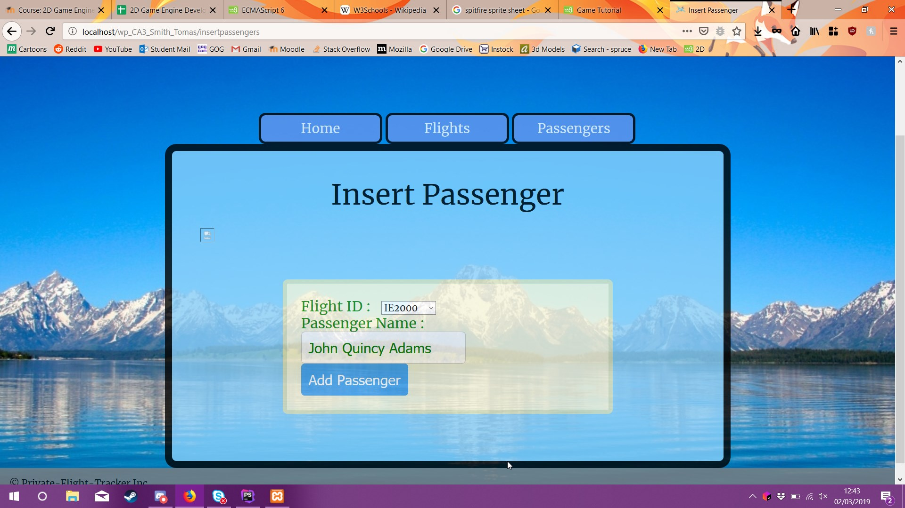
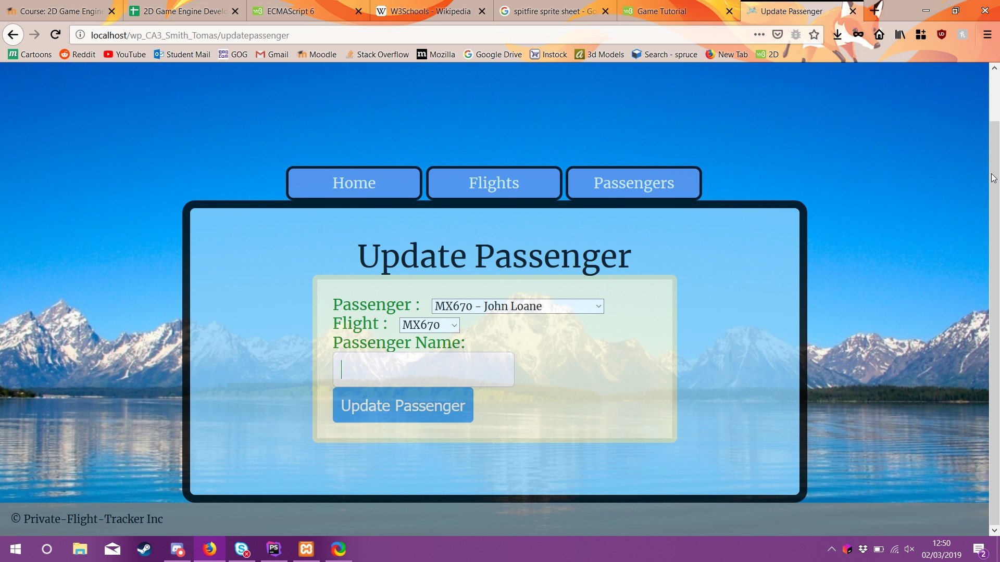
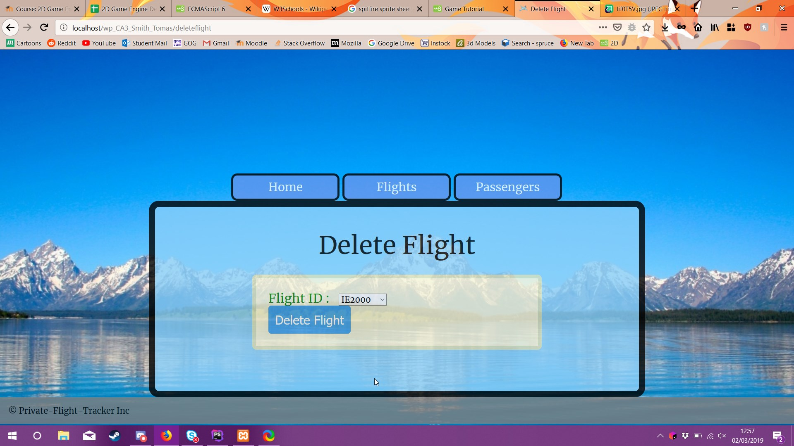
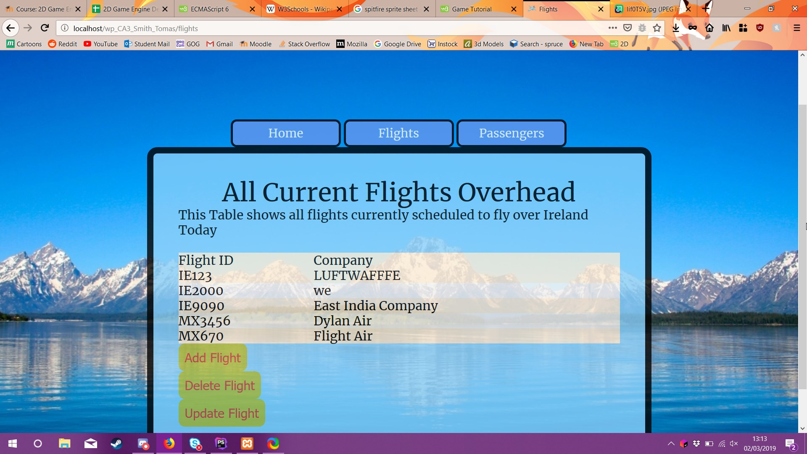
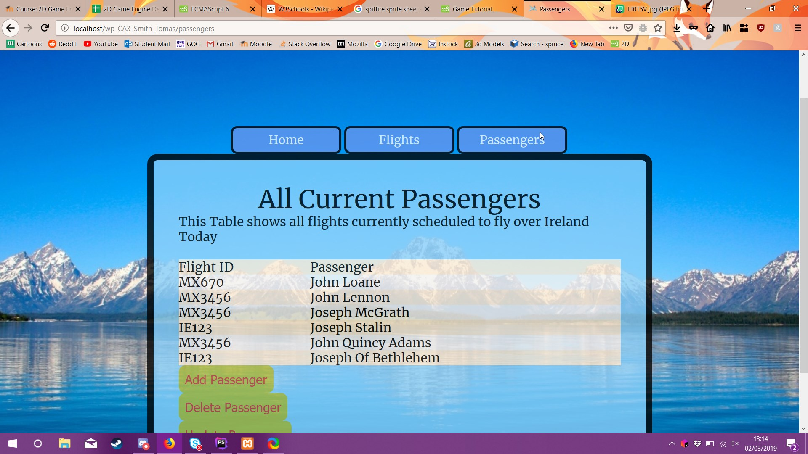

#Flight Tracker inc

###Descripton
The flight Tracker website in theory is used to track all private flights over Ireland.
It shows all the private flights and all 
passengers in said flights.
Each flight is marked by a unique FlightID. Each Passenger is marked with a 
unique passenger ID what flight they are travelling on and what their name is.

####Functions

1.Add Flight or Passengers
    

    The Ability to Add flights or passengers is very straight forward only thing is FlightIDs
    Must containt to letters followed by four numbers e.g IE2415 and they must also not be 
    duplicates of other FlightIDS
2.Edit Flights and Passengers
    

    Allows the seamless editing of both the flights and passenger tables only not 
    allowing the editing of the primary keys o both tables it does however let the
     editing of the foreign key on the passenger table.
     
3.Delete of Both Flights and Passengers

    It allows the deletion of both flights and passengers. In the case of flights it
     will delete all children of the flight before deleteingthe flight itself.
     
4.Display Of both Tables

    It allows you to see both tables and all their contents and the relationship between the two
    
    
    
####Authors
-Tomas Smith